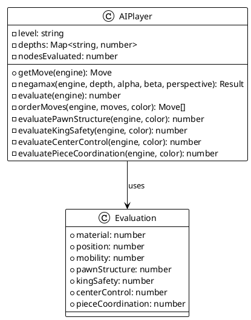
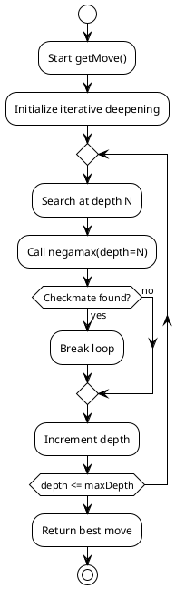
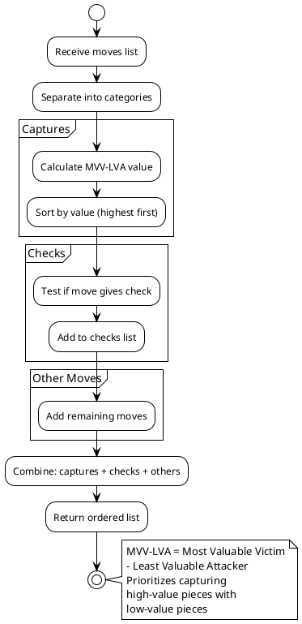
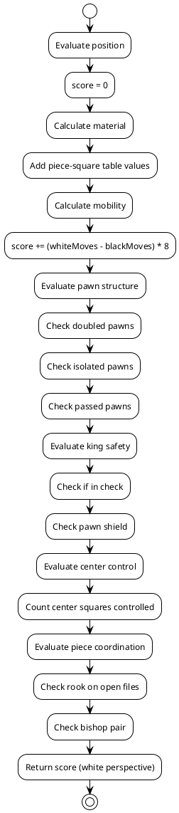
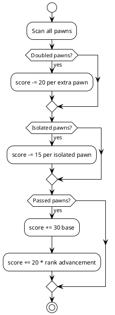
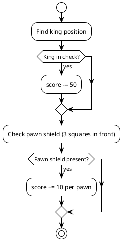
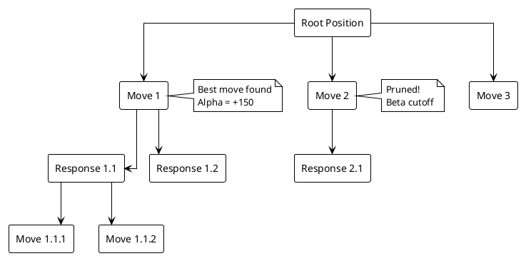

# AI Algorithm Documentation

## Overview

The AI uses the **Negamax algorithm** with **alpha-beta pruning**, **iterative deepening**, and **move ordering** to find optimal moves.

## Algorithm Architecture



## Search Algorithm Flow



## Negamax Algorithm

```plantuml
@startuml
!theme plain

start

:negamax(depth, alpha, beta, perspective);

if (depth == 0?) then (yes)
  :Return evaluate() * perspective;
  stop
endif

if (Game ended?) then (yes)
  :Return terminal score;
  stop
endif

:Get all legal moves;
:Order moves (captures first);

if (No moves?) then (yes)
  if (In check?) then (yes)
    :Return -10000 * perspective;
  else (no)
    :Return 0 (stalemate);
  endif
  stop
endif

:bestScore = -Infinity;

repeat for each move
  :Make move;
  
  if (depth == 1 && capture/check?) then (yes)
    :Quiescence search (depth=2);
  else (no)
    :Recurse negamax(depth-1);
  endif
  
  :score = -negamax(...).score;
  
  if (score > bestScore?) then (yes)
    :bestScore = score;
    :bestMove = move;
  endif
  
  :alpha = max(alpha, score);
  
  if (alpha >= beta?) then (yes)
    :Beta cutoff (prune);
    break
  endif
repeat

:Return {score: bestScore, move: bestMove};

stop

@enduml
```

## Move Ordering



## Evaluation Function



## Difficulty Levels

| Level | Search Depth | Nodes Evaluated (avg) | Time per Move |
|-------|-------------|----------------------|---------------|
| Easy  | 4           | ~10,000              | < 1s          |
| Medium| 5           | ~50,000              | 1-3s          |
| Hard  | 6           | ~200,000             | 3-10s         |

## Evaluation Components

### Material Values

```javascript
pawn:   100
knight: 320
bishop: 330
rook:   500
queen:  900
king:   20000
```

### Position Tables

Each piece type has a position table that assigns values to squares:

```plantuml
@startuml
!theme plain

object "Pawn Table" {
  Rank 7: 0 (promotion rank)
  Rank 6: 50 (starting rank)
  Rank 5: 10-30 (advancing)
  Rank 4: 5-25 (center)
  Rank 3: 0-20 (center)
  Rank 2: -10-5 (weak)
  Rank 1: -20-5 (very weak)
  Rank 0: 0 (back rank)
}

object "Knight Table" {
  Center squares: +15-20
  Edge squares: -20-40
  Corner squares: -50
}

@enduml
```

### Pawn Structure Evaluation



### King Safety Evaluation



## Performance Optimizations

1. **Alpha-Beta Pruning**: Eliminates branches that cannot improve the best move
2. **Move Ordering**: Examines best moves first, increasing pruning efficiency
3. **Iterative Deepening**: Searches shallow first, uses best move from previous depth
4. **Quiescence Search**: Continues searching captures/checks at leaf nodes
5. **Early Termination**: Stops searching if checkmate found

## Search Tree Visualization



## Example Calculation

```
Position: White to move, material equal

1. Generate all legal moves (20 moves)
2. Order moves:
   - Captures: QxR (+400), RxN (+180)
   - Checks: Nf6+ (+50)
   - Others: e4, d4, etc.
3. Search depth 5:
   - Try QxR: score = +420
   - Try RxN: score = +200
   - Try Nf6+: score = +50
   - Try e4: score = +30
   ...
4. Best move: QxR (queen takes rook)
5. Return move
```

## Time Complexity

- **Time**: O(b^d) where b = branching factor (~35), d = depth
- **With pruning**: O(b^(d/2)) average case
- **Space**: O(d) for recursion stack

## Future Improvements

1. **Transposition Table**: Cache evaluated positions
2. **Opening Book**: Precomputed opening moves
3. **Endgame Tablebase**: Perfect endgame play
4. **Null Move Pruning**: Additional pruning technique
5. **Late Move Reduction**: Reduce depth for late moves
