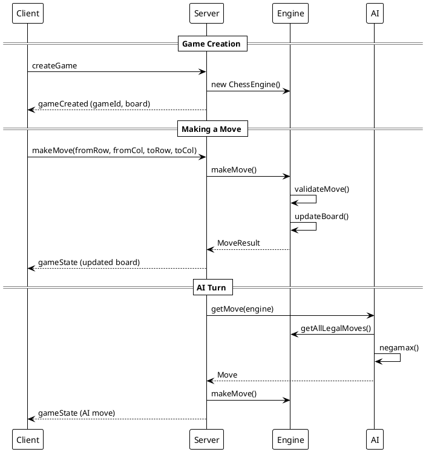
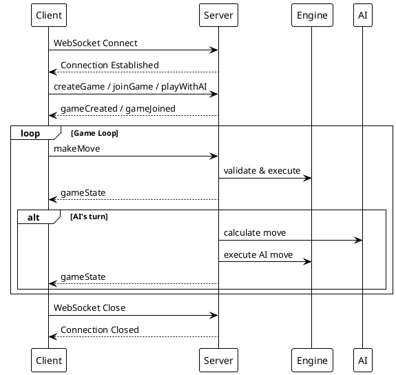

# API Documentation

## WebSocket API

The application uses WebSocket for real-time bidirectional communication between client and server.

### Connection

**Endpoint:** `ws://localhost:3001` (or `wss://` for secure connections)

**Protocol:** WebSocket (RFC 6455)

### Message Format

All messages are JSON objects with the following structure:

```json
{
  "type": "messageType",
  "data": { ... }
}
```

## Client to Server Messages

### createGame

Creates a new two-player game.

**Request:**
```json
{
  "type": "createGame"
}
```

**Response:**
```json
{
  "type": "gameCreated",
  "gameId": "abc123",
  "color": "white",
  "board": [[...]],
  "turn": "white",
  "gameStatus": "active"
}
```

### joinGame

Joins an existing game.

**Request:**
```json
{
  "type": "joinGame",
  "gameId": "abc123"
}
```

**Response:**
```json
{
  "type": "gameJoined",
  "gameId": "abc123",
  "color": "black",
  "board": [[...]],
  "turn": "white",
  "gameStatus": "active"
}
```

### playWithAI

Starts a new game against AI.

**Request:**
```json
{
  "type": "playWithAI",
  "color": "white",
  "aiLevel": "medium"
}
```

**Parameters:**
- `color` (string, optional): "white" or "black" (default: "white")
- `aiLevel` (string, optional): "easy", "medium", or "hard" (default: "medium")

**Response:**
```json
{
  "type": "gameCreated",
  "gameId": "xyz789",
  "color": "white",
  "board": [[...]],
  "turn": "white",
  "gameStatus": "active",
  "aiLevel": "medium"
}
```

### makeMove

Makes a chess move.

**Request:**
```json
{
  "type": "makeMove",
  "fromRow": 6,
  "fromCol": 4,
  "toRow": 4,
  "toCol": 4,
  "promotion": "queen"
}
```

**Parameters:**
- `fromRow` (number, required): Source row (0-7)
- `fromCol` (number, required): Source column (0-7)
- `toRow` (number, required): Target row (0-7)
- `toCol` (number, required): Target column (0-7)
- `promotion` (string, optional): "queen", "rook", "bishop", or "knight" (for pawn promotion)

**Response (Success):**
```json
{
  "type": "gameState",
  "board": [[...]],
  "turn": "black",
  "gameStatus": "active",
  "enPassantTarget": null,
  "moveHistory": [...]
}
```

**Response (Error):**
```json
{
  "type": "error",
  "message": "Illegal move"
}
```

## Server to Client Messages

### gameState

Broadcasted after any move to update all players.

```json
{
  "type": "gameState",
  "board": [[...]],
  "turn": "white",
  "gameStatus": "active",
  "enPassantTarget": { "row": 3, "col": 4 },
  "moveHistory": [
    {
      "from": { "row": 6, "col": 4 },
      "to": { "row": 4, "col": 4 },
      "piece": "pawn",
      "captured": null,
      "promotion": null
    }
  ]
}
```

### playerJoined

Notifies when a second player joins a game.

```json
{
  "type": "playerJoined",
  "color": "black"
}
```

### error

Error messages.

```json
{
  "type": "error",
  "message": "Game not found"
}
```

## Board Representation

The board is represented as an 8x8 array:

```javascript
[
  [piece, piece, ..., piece], // Row 0 (black's back rank)
  [piece, piece, ..., piece], // Row 1 (black's pawns)
  [null, null, ..., null],     // Row 2
  ...
  [null, null, ..., null],     // Row 5
  [piece, piece, ..., piece], // Row 6 (white's pawns)
  [piece, piece, ..., piece]  // Row 7 (white's back rank)
]
```

**Piece Object:**
```json
{
  "type": "pawn" | "rook" | "knight" | "bishop" | "queen" | "king",
  "color": "white" | "black"
}
```

## Game Status Values

- `"active"` - Game in progress
- `"checkmate"` - Game ended in checkmate
- `"stalemate" - Game ended in stalemate

## Error Messages

| Message | Description |
|---------|-------------|
| `"Invalid message format"` | Malformed JSON or missing required fields |
| `"Unknown message type"` | Unrecognized message type |
| `"Game not found"` | Invalid game ID |
| `"Game is full"` | Game already has two players |
| `"Not in a game"` | Player not associated with any game |
| `"Not your turn"` | Attempted move out of turn |
| `"Invalid move"` | Move violates basic rules |
| `"Illegal move"` | Move would leave own king in check |

## Sequence Diagram



## Connection Lifecycle


