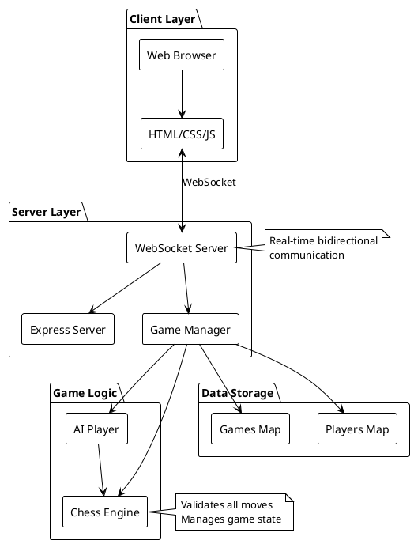
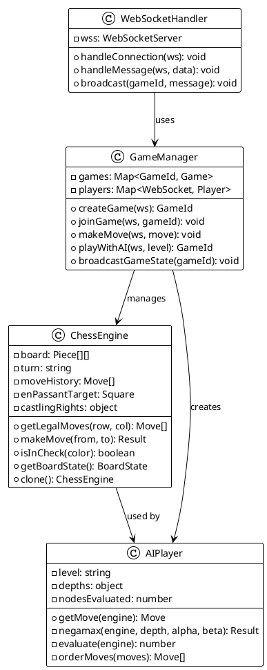
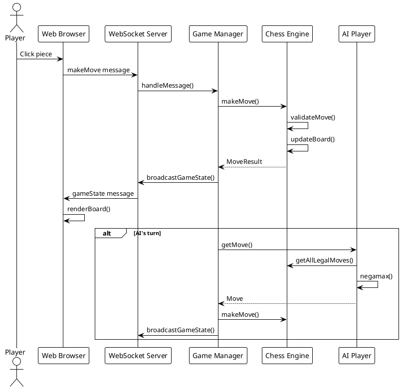
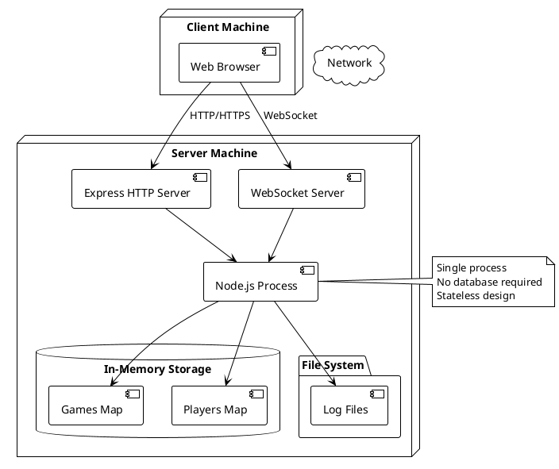

# Architecture Overview

## System Architecture

## Component Diagram

## Data Flow

## Deployment Architecture

## Technology Stack

### Backend
- **Node.js** - Runtime environment
- **Express** - HTTP server framework
- **ws** - WebSocket library
- **Custom Chess Engine** - Move validation and game logic

### Frontend
- **HTML5** - Structure
- **CSS3** - Styling and animations
- **Vanilla JavaScript** - Client-side logic
- **SVG** - Chess piece graphics

### Infrastructure
- **File System** - Logging
- **In-Memory Storage** - Game state (Maps)
- **WebSocket Protocol** - Real-time communication
