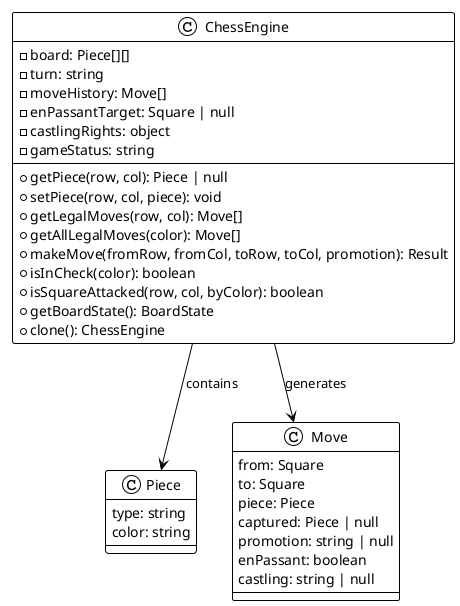
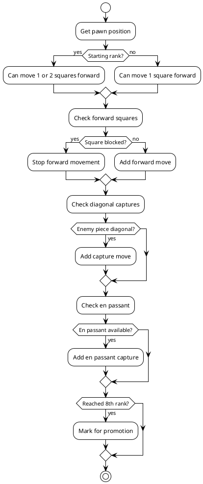
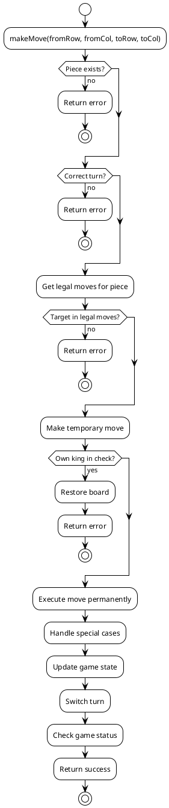
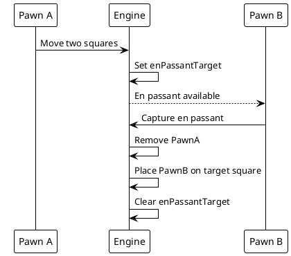
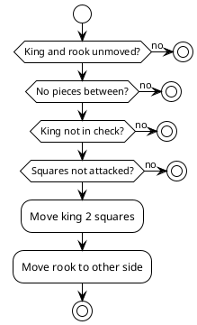
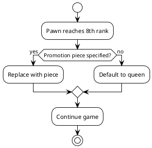
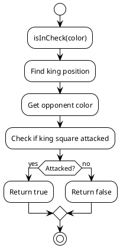
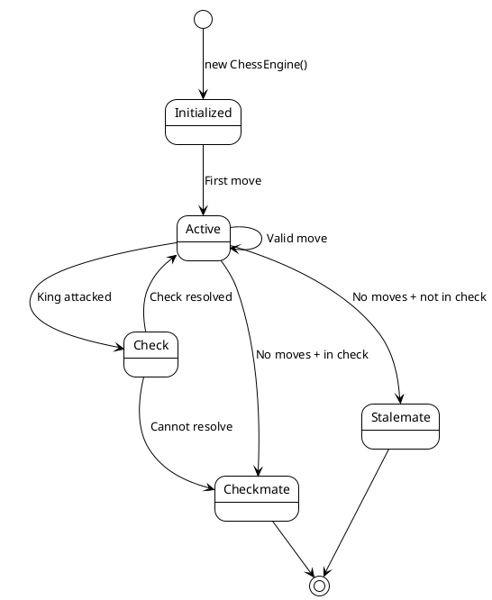
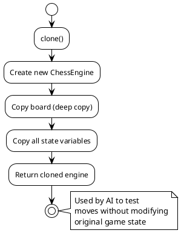

# Chess Engine Documentation

## Overview

The chess engine validates all moves according to FIDE rules, including special moves like en passant, castling, and pawn promotion.

## Class Structure



## Move Generation Flow

```plantuml
@startuml
!theme plain

start

:getLegalMoves(row, col);

:Get piece at square;

if (No piece?) then (yes)
  :Return [];
  stop
endif

:Get possible moves for piece type;

repeat for each possible move
  :Check if move is legal;
  
  if (Would leave king in check?) then (yes)
    :Skip move;
  else (no)
    :Add to legal moves;
  endif
repeat

:Return legal moves;

stop

@enduml
```

## Piece Movement Rules

### Pawn Movement



### King Movement

```plantuml
@startuml
!theme plain

start

:Get king position;

:Check 8 adjacent squares;

repeat for each direction
  if (Square on board?) then (no)
    :Skip;
  else (yes)
    if (Own piece?) then (yes)
      :Skip;
    else (no)
      :Add move;
    endif
  endif
repeat

:Check castling;

if (Kingside castling available?) then (yes)
  if (Squares clear and not attacked?) then (yes)
    :Add castling move;
  endif
endif

if (Queenside castling available?) then (yes)
  if (Squares clear and not attacked?) then (yes)
    :Add castling move;
  endif
endif

stop

@enduml
```

## Move Validation



## Special Moves

### En Passant



### Castling



### Pawn Promotion



## Check Detection



## Attack Detection

```plantuml
@startuml
!theme plain

start

:isSquareAttacked(row, col, byColor);

repeat for each piece of byColor
  :Check if piece can attack square;
  
  switch (piece type)
  case pawn
    :Check diagonal attack;
  case knight
    :Check L-shaped moves;
  case bishop
    :Check diagonal path;
  case rook
    :Check horizontal/vertical path;
  case queen
    :Check all directions;
  case king
    :Check adjacent squares;
  endswitch
  
  if (Can attack?) then (yes)
    :Return true;
  endif
repeat

:Return false;

stop

@enduml
```

## Game State Management

```plantuml
@startuml
!theme plain

object "Board State" {
  board: Piece[][]
  turn: string
  gameStatus: string
  enPassantTarget: Square | null
  moveHistory: Move[]
}

object "Castling Rights" {
  white: {
    kingside: boolean
    queenside: boolean
  }
  black: {
    kingside: boolean
    queenside: boolean
  }
}

ChessEngine --> "Board State"
ChessEngine --> "Castling Rights"

@enduml
```

## State Transitions



## Board Representation

```
Row 0: Black back rank (rook, knight, bishop, queen, king, bishop, knight, rook)
Row 1: Black pawns
Row 2-5: Empty squares
Row 6: White pawns
Row 7: White back rank (rook, knight, bishop, queen, king, bishop, knight, rook)
```

## Coordinate System

- **Rows**: 0-7 (0 = black's back rank, 7 = white's back rank)
- **Columns**: 0-7 (0 = a-file, 7 = h-file)
- **Squares**: [row][col] format

## Move History

Each move is recorded with:
- `from`: Source square
- `to`: Target square
- `piece`: Piece type moved
- `captured`: Captured piece (if any)
- `promotion`: Promotion piece (if pawn promotion)

## Clone Function

The engine can clone itself for AI search:


