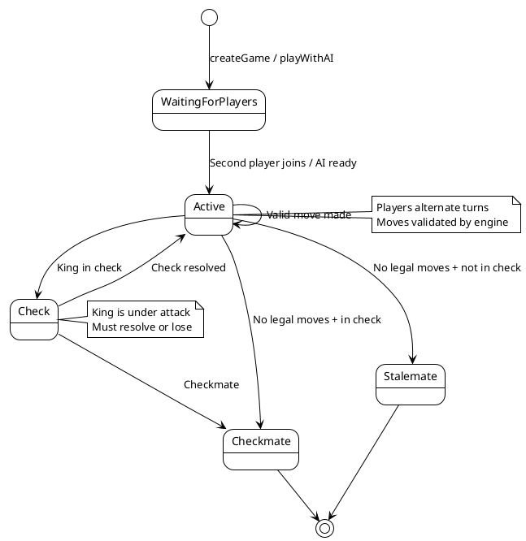
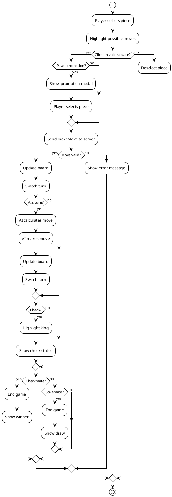
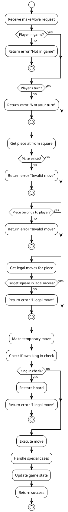
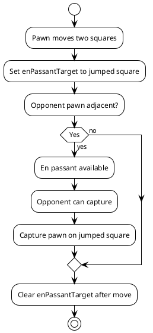
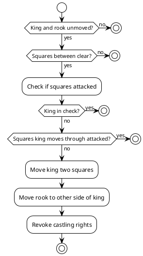
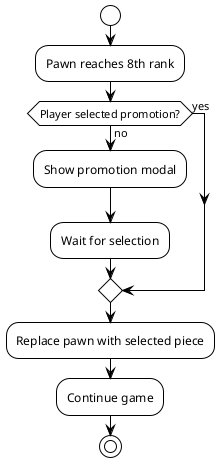
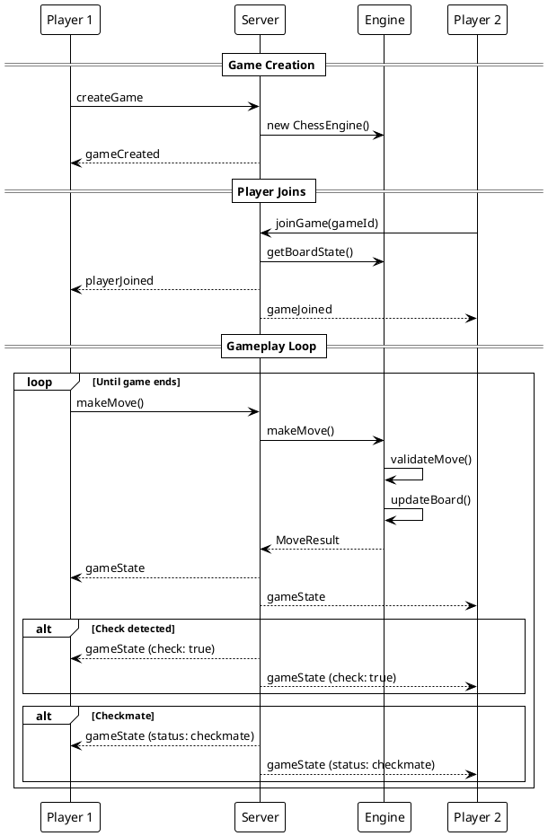

# Game Flow Documentation

## Game State Machine



## Turn Flow



## Move Validation Flow



## Special Move Handling

### En Passant Flow



### Castling Flow



### Pawn Promotion Flow



## Game Lifecycle



## Error Handling Flow

```plantuml
@startuml
!theme plain

start

:Receive message;

if (Valid JSON?) then (no)
  :Log error;
  :Send "Invalid message format";
  stop
else (yes)
endif

if (Known message type?) then (no)
  :Log error;
  :Send "Unknown message type";
  stop
else (yes)
endif

:Route to handler;

try {
  :Execute handler;
} catch (Exception) {
  :Log error with stack trace;
  :Send "Server error";
}

stop

@enduml
```
