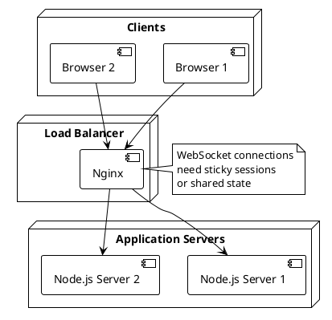

# Installation Guide

## Prerequisites

- **Node.js** version 14.0 or higher
- **npm** (comes with Node.js)
- **Modern web browser** with WebSocket support

## Installation Steps

### 1. Clone or Download

```bash
cd /path/to/chess
```

### 2. Install Dependencies

```bash
npm install
```

This will install:
- `express` - HTTP server framework
- `ws` - WebSocket library

### 3. Start the Server

```bash
npm start
```

Or:

```bash
node server.js
```

### 4. Access the Application

Open your browser and navigate to:

```
http://localhost:3001
```

## Configuration

### Environment Variables

You can configure the server using environment variables:

```bash
PORT=3001 node server.js
```

**Available Variables:**
- `PORT` - Server port (default: 3001)

### Logging

Logs are automatically created in the `logs/` directory:

- **Daily logs**: `logs/server-YYYY-MM-DD.log`
- **Server output**: `logs/server-output.log`

## Production Deployment

### Using PM2

```bash
npm install -g pm2
pm2 start server.js --name chess-server
pm2 save
pm2 startup
```

### Using systemd

Create `/etc/systemd/system/chess-server.service`:

```ini
[Unit]
Description=Chess Game Server
After=network.target

[Service]
Type=simple
User=your-user
WorkingDirectory=/path/to/chess
ExecStart=/usr/bin/node server.js
Restart=always
RestartSec=10

[Install]
WantedBy=multi-user.target
```

Enable and start:

```bash
sudo systemctl enable chess-server
sudo systemctl start chess-server
```

### Using Docker

Create `Dockerfile`:

```dockerfile
FROM node:18-alpine

WORKDIR /app

COPY package*.json ./
RUN npm install --production

COPY . .

EXPOSE 3001

CMD ["node", "server.js"]
```

Build and run:

```bash
docker build -t chess-game .
docker run -p 3001:3001 chess-game
```

## Deployment Architecture



## Troubleshooting

### Port Already in Use

```bash
# Find process using port 3001
lsof -i :3001

# Kill the process
kill -9 <PID>
```

### Permission Denied

```bash
# Make sure you have write permissions
chmod -R 755 /path/to/chess
```

### WebSocket Connection Failed

- Check firewall settings
- Verify port is open
- Check server logs for errors

### Server Crashes

Check logs:

```bash
tail -f logs/server-$(date +%Y-%m-%d).log
```

## Development Setup

### Install Development Dependencies

```bash
npm install --save-dev
```

### Run with Debug Logging

The server includes comprehensive logging. Check logs directory for details.

### Hot Reload (Development)

Install `nodemon`:

```bash
npm install -g nodemon
nodemon server.js
```

## Health Check

The server responds to HTTP requests:

```bash
curl http://localhost:3001
```

Should return the HTML page (200 OK).

## Security Considerations

1. **WebSocket Security**: Use `wss://` in production with SSL/TLS
2. **Input Validation**: All moves are validated server-side
3. **Rate Limiting**: Consider adding rate limiting for production
4. **CORS**: Configure CORS if needed for cross-origin requests

## Monitoring

### Process Monitoring

```bash
# Check if server is running
ps aux | grep "node server.js"

# Check port
netstat -tlnp | grep 3001
```

### Log Monitoring

```bash
# Follow logs in real-time
tail -f logs/server-$(date +%Y-%m-%d).log

# Search for errors
grep ERROR logs/server-*.log
```

## Backup

The server uses in-memory storage. For persistence:

1. Implement database storage
2. Save game states periodically
3. Implement game state recovery

## Scaling

For multiple servers:

1. Use Redis for shared game state
2. Implement sticky sessions for WebSocket
3. Use message queue for game events

```plantuml
@startuml
!theme plain

node "Load Balancer" {
  [Nginx] as LB
}

node "App Servers" {
  [Server 1] as S1
  [Server 2] as S2
}

cloud "Redis" {
  [Game State] as Redis
}

S1 --> Redis
S2 --> Redis
LB --> S1
LB --> S2

@enduml
```
